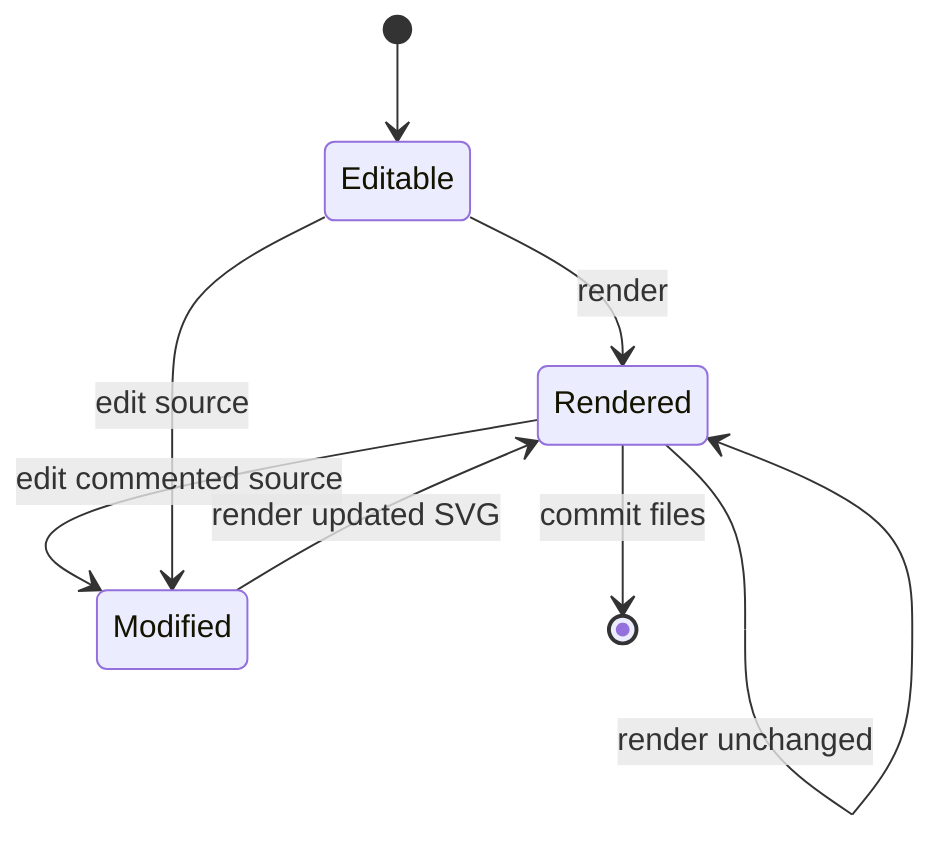

# Diagram lifecycle

Diagram sources move between editable, rendered, and modified states.

```mermaid
stateDiagram-v2
    [*] --> Editable
    Editable --> Rendered: render
    Rendered --> Rendered: render unchanged
    Rendered --> Modified: edit commented source
    Editable --> Modified: edit source
    Modified --> Rendered: render updated SVG
    Rendered --> [*]: commit files
```
